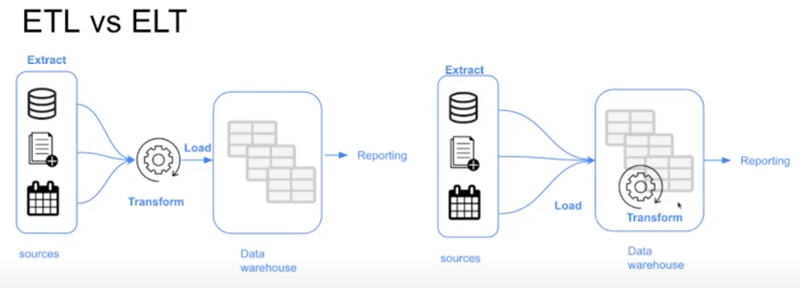

# Analytics Engineering

## Introduction to Analytics Engineering

### What is Analytics Engineering?

As the _data domain_ has developed over time, new tools have been introduced that have changed the dynamics of working with data:

1. Massively parallel processing (MPP) databases
   * Lower the cost of storage 
   * BigQuery, Snowflake, Redshift...
2. Data-pipelines-as-a-service
   * Simplify the ETL process
   * Fivetran, Stitch...
3. SQL-first / Version control systems
   * Looker...
4. Self service analytics
   * Mode...
5. Data governance

The introduction of all of these tools changed the way the data teams work as well as the way that the stakeholders consume the data, creating a gap in the roles of the data team. Traditionally:

* The ***data engineer*** prepares and maintains the infrastructure the data team needs.
* The ***data analyst*** uses data to answer questions and solve problems (they are in charge of _today_).
* The ***data scientist*** predicts the future based on past patterns and covers the what-ifs rather than the day-to-day (they are in charge of _tomorrow_).

However, with the introduction of these tools, both data scientists and analysts find themselves writing more code even though they're not software engineers and writing code isn't their top priority.  Data engineers are good software engineers but they don't have the training in how the data is going to be used  by the business users.

The ***analytics engineer*** is the role that tries to fill the gap: it introduces the good software engineering practices to the efforts of data analysts and data scientists. The analytics engineer may be exposed to the following tools:
1. Data Loading (Stitch...)
    * Data Ingestion / Extraction
    * Data Transformation
    * Data Loading
2. Data Storing (Data Warehouses)
3. Data Modeling (dbt, Dataform...)
4. Data Presentation (BI tools like Looker, Mode, Tableau...)

### Data Modeling Concepts

#### ETL vs ELT



[Ralph Kimball's Dimensional Modeling](https://www.wikiwand.com/en/Dimensional_modeling#:~:text=Dimensional%20modeling%20(DM)%20is%20part,use%20in%20data%20warehouse%20design.) is an approach to Data Warehouse design which focuses on 2 main points:
* Deliver data which is understandable to the business users.
* Deliver fast query performance.

Other goals such as reducing redundant data (prioritized by other approaches such as [3NF](https://www.wikiwand.com/en/Third_normal_form#:~:text=Third%20normal%20form%20(3NF)%20is,integrity%2C%20and%20simplify%20data%20management.) by [Bill Inmon](https://www.wikiwand.com/en/Bill_Inmon)) are secondary to these goals. Dimensional Modeling also differs from other approaches to Data Warehouse design such as [Data Vaults](https://www.wikiwand.com/en/Data_vault_modeling).

Dimensional Modeling is based around 2 important concepts:
* ***Fact Table***:
    * _Facts_ = _Measures_
    * Typically numeric values which can be aggregated, such as measurements or metrics.
        * Examples: sales, orders, etc.
    * Corresponds to a [_business process_ ](https://www.wikiwand.com/en/Business_process).
    * Can be thought of as _"verbs"_.
* ***Dimension Table***:
    * _Dimension_ = _Context_
    * Groups of hierarchies and descriptors that define the facts.
        * Example: customer, product, etc.
    * Corresponds to a _business entity_.
    * Can be thought of as _"nouns"_.
* Dimensional Modeling is built on a [***star schema***](https://www.wikiwand.com/en/Star_schema) with fact tables surrounded by dimension tables.

A good way to understand the _architecture_ of Dimensional Modeling is by drawing an analogy between dimensional modeling and a restaurant:
* Stage Area:
    * Contains the raw data.
    * Not meant to be exposed to everyone.
    * Similar to the food storage area in a restaurant.
* Processing area:
    * From raw data to data models.
    * Focuses in efficiency and ensuring standards.
    * Similar to the kitchen in a restaurant.
* Presentation area:
    * Final presentation of the data.
    * Exposure to business stakeholder.
    * Similar to the dining room in a restaurant.

## Data Build Tool (dbt)

### dbt Cloud Setup

Check ther [dbt Cloud Setup](https://github.com/DataTalksClub/data-engineering-zoomcamp/blob/main/04-analytics-engineering/dbt_cloud_setup.md) for the instructions on how to set up dbt Cloud.

>Before going further, make sure you have data warehouse setup (BigQuery). For instructions on how to set up BigQuery, check the [BigQuery Setup](https://www.youtube.com/watch?v=Mork172sK_c&list=PLaNLNpjZpzwgneiI-Gl8df8GCsPYp_6Bs) or by using week 3 data warehouse setup.

### dbt Models

#### Anatomy of a dbt Model

dbt models are mostly written in SQL (remember that a dbt model is essentially a `SELECT` query) but they also make use of the [Jinja templating language](https://jinja.palletsprojects.com/en/3.0.x/) for templates.

Here's an example dbt model:

```sql
{{
    config(materialized='table')
}}

SELECT *
FROM staging.source_table
WHERE record_state = 'ACTIVE'
```

* In the Jinja statement defined within the `{{ }}` block we call the [`config()` function](https://docs.getdbt.com/reference/dbt-jinja-functions/config).
    * More info about Jinja macros for dbt [in this link](https://docs.getdbt.com/docs/building-a-dbt-project/jinja-macros).
* We commonly use the `config()` function at the beginning of a model to define a ***materialization strategy***: a strategy for persisting dbt models in a warehouse.
    * The `table` strategy means that the model will be rebuilt as a table on each run.
    * We could use a `view` strategy instead, which would rebuild the model on each run as a SQL view.
    * The `incremental` strategy is essentially a `table` strategy but it allows us to add or update records incrementally rather than rebuilding the complete table on each run.
    * The `ephemeral` strategy creates a _[Common Table Expression](https://www.essentialsql.com/introduction-common-table-expressions-ctes/)_ (CTE).
    * You can learn more about materialization strategies with dbt [in this link](https://docs.getdbt.com/docs/building-a-dbt-project/building-models/materializations). Besides the 4 common `table`, `view`, `incremental` and `ephemeral` strategies, custom strategies can be defined for advanced cases.

dbt will compile this code into the following SQL query:

```sql
CREATE TABLE my_schema.my_model AS (
    SELECT *
    FROM staging.source_table
    WHERE record_state = 'ACTIVE'
)
```

After the code is compiled, dbt will run the compiled code in the Data Warehouse.

#### The `FROM` Clause

The `FROM` clause within a `SELECT` statement defines the _sources_ of the data to be used.

The following sources are available to dbt models:

* ***Sources***: The data loaded within our Data Warehouse.
    * We can access this data with the `source()` function.
    * The `sources` key in our YAML file contains the details of the databases that the `source()` function can access and translate into proper SQL-valid names.
        * Additionally, we can define "source freshness" to each source so that we can check whether a source is "fresh" or "stale", which can be useful to check whether our data pipelines are working properly.
    * More info about sources [in this link](https://docs.getdbt.com/docs/building-a-dbt-project/using-sources).
* ***Seeds***: CSV files which can be stored in our repo under the `seeds` folder.
    * The repo gives us version controlling along with all of its benefits.
    * Seeds are best suited to static data which changes infrequently.
    * Seed usage:
        1. Add a CSV file to your `seeds` folder.
        1. Run the [`dbt seed` command](https://docs.getdbt.com/reference/commands/seed) to create a table in our Data Warehouse.
            * If you update the content of a seed, running `dbt seed` will append the updated values to the table rather than substituing them. Running `dbt seed --full-refresh` instead will drop the old table and create a new one.
        1. Refer to the seed in your model with the `ref()` function.
    * More info about seeds [in this link](https://docs.getdbt.com/docs/building-a-dbt-project/seeds).

Here's an example of how you would declare a source in a `.yml` file:

```yaml
sources:
    - name: staging
      database: production
      schema: trips_data_all

      loaded_at_field: record_loaded_at
      tables:
        - name: green_tripdata
        - name: yellow_tripdata
          freshness:
            error_after: {count: 6, period: hour}
```

And here's how you would reference a source in a `FROM` clause:

```sql
FROM {{ source('staging','yellow_tripdata') }}
```
* The first argument of the `source()` function is the source name, and the second is the table name.

In the case of seeds, assuming you've got a `taxi_zone_lookup.csv` file in your `seeds` folder which contains `locationid`, `borough`, `zone` and `service_zone`:

```sql
SELECT
    locationid,
    borough,
    zone,
    replace(service_zone, 'Boro', 'Green') as service_zone
FROM {{ ref('taxi_zone_lookup) }}
```

The `ref()` function references underlying tables and views in the Data Warehouse. When compiled, it will automatically build the dependencies and resolve the correct schema fo us. So, if BigQuery contains a schema/dataset called `dbt_dev` inside the `my_project` database which we're using for development and it contains a table called `stg_green_tripdata`, then the following code...

```sql
WITH green_data AS (
    SELECT *,
        'Green' AS service_type
    FROM {{ ref('stg_green_tripdata') }}
),
```

...will compile to this:

```sql
WITH green_data AS (
    SELECT *,
        'Green' AS service_type
    FROM "my_project"."dbt_dev"."stg_green_tripdata"
),
```
* The `ref()` function translates our references table into the full reference, using the `database.schema.table` structure.
* If we were to run this code in our production environment, dbt would automatically resolve the reference to make ir point to our production schema.

#### Defining a Source and Creating a Model (Practice)

We will now create our first model.

We will begin by creating 2 new folders under our `models` folder:
* `staging` will have the raw models.
* `core` will have the models that we will expose at the end to the BI tool, stakeholders, etc.

Under `staging` we will add new file called `schema.yml`:
```yaml
# schema.yml

version: 2

sources:
  - name: staging
    database: dataset-name (gcp/bigquery project name)
    schema: ny_taxi_trip_all

    tables:
      - name: green_trip_data
      - name: yellow_trip_data
```
* We define our ***sources*** in the `schema.yml` model properties file.
* We are defining the 2 tables for yellow and green taxi data as our sources.
* Next, we can build dbt models from table names defined in the `schema.yml` file. And here's the generated result for `green_trip_data`:
```sql
-- stg_staging__green_trip_data.sql.sql

with 

source as (

    select * from {{ source('staging', 'green_trip_data') }}

),

renamed as (

    select
        -- all column name here,
        -- ...

    from source

)

select * from renamed

```
* We make use of the `source()` function to access the green taxi data table, which is defined inside the `schema.yml` file.
* Besides by generating tables from the `schema.yml` file, we can also make manual changes to the generated SQL file to add more columns, filters, etc.

The advantage of having the properties in a separate file is that we can easily modify the `schema.yml` file to change the database details and write to different databases without having to modify our `stg_staging__green_trip_data.sql` file.

#### Macros

***Macros*** are pieces of code in Jinja that can be reused, similar to functions in other languages.

dbt already includes a series of macros like `config()`, `source()` and `ref()`, but custom macros can also be defined.

Macros allow us to add features to SQL that aren't otherwise available, such as:
* Use control structures such as `if` statements or `for` loops.
* Use environment variables in our dbt project for production.
* Operate on the results of one query to generate another query.
* Abstract snippets of SQL into reusable macros.

Macros are defined in separate `.sql` files which are typically stored in a `macros` directory.

There are 3 kinds of Jinja _delimiters_:
* `` for ***statements*** (control blocks, macro definitions)
* `{{ ... }}` for ***expressions*** (literals, math, comparisons, logic, macro calls...)
* `{# ... #}` for comments.

Here's a macro definition example:

```sql
{# This macro returns the description of the payment_type #}



    case {{ payment_type }}
        when 1 then 'Credit card'
        when 2 then 'Cash'
        when 3 then 'No charge'
        when 4 then 'Dispute'
        when 5 then 'Unknown'
        when 6 then 'Voided trip'
    end


```
* The `macro` keyword states that the line is a macro definition. It includes the name of the macro as well as the parameters.
* The code of the macro itself goes between 2 statement delimiters. The second statement delimiter contains an `endmacro` keyword.
* In the code, we can access the macro parameters using expression delimiters.
* The macro returns the ***code*** we've defined rather than a specific value.

Here's how we use the macro:
```sql
select
    {{ get_payment_type_description('payment-type') }} as payment_type_description,
    congestion_surcharge::double precision
from {{ source('staging','green_tripdata') }}
where vendorid is not null
```
* We pass a `payment-type` variable which may be an integer from 1 to 6.

And this is what it would compile to:
```sql
select
    case payment_type
        when 1 then 'Credit card'
        when 2 then 'Cash'
        when 3 then 'No charge'
        when 4 then 'Dispute'
        when 5 then 'Unknown'
        when 6 then 'Voided trip'
    end as payment_type_description,
    congestion_surcharge::double precision
from {{ source('staging','green_tripdata') }}
where vendorid is not null
```
* The macro is replaced by the code contained within the macro definition as well as any variables that we may have passed to the macro parameters.

## Acknowledgements

* [Notes by Alvaro Navas](https://github.com/ziritrion/dataeng-zoomcamp/blob/main/notes/4_analytics.md)